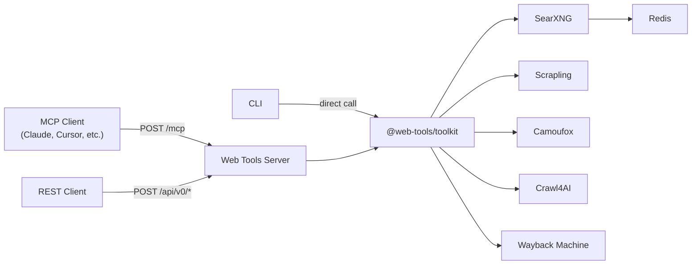

# Web Tools

A self-hosted web toolkit providing fourteen tools for search, content extraction, and archival. Available as an [MCP](https://modelcontextprotocol.io/) server, REST API, and CLI, powered by [SearXNG](https://github.com/searxng/searxng), [Crawl4AI](https://github.com/unclecode/crawl4ai), [Scrapling](https://github.com/D4Vinci/Scrapling), [Camoufox](https://github.com/daijro/camoufox), and the [Wayback Machine](https://web.archive.org/).

## Architecture



### Why three fetchers

They are not redundant. Each reaches pages the others cannot, and the split is
measured rather than aesthetic:

| | Crawl4AI | Scrapling | Camoufox |
| --- | --- | --- | --- |
| Browser | Chromium | Patchright Chromium | **Firefox** |
| Egress | this host's IP only¹ | rotating **US** residential | rotating **Italian** residential |
| JS challenges | no | yes (`solve`) | n/a (coherent fingerprint) |
| LinkedIn profiles | decays to 0/6, HTTP 999 | 94% (34/36) | not measured |
| Trustpilot reviews | luck-of-the-IP | 2/2 via challenge solve | not measured |
| Italian bot-gated sites | blocked | wrong country | **the point** |
| Binary / PDF fetch | no | no | yes (`web_bytes`) |
| Anti-bot sensor sessions | no | no | yes (`web_spa_fetch`) |
| Ordinary pages | ~2-5s | ~0.7-1.9s (`fast`) | ~8-12s |

Camoufox is Firefox on purpose: stealth-patched headless *Chrome* was flagged by
Akamai even through an Italian residential IP, while Camoufox's fingerprint is
internally coherent: its locale and timezone are derived from the exit IP, so
`web_eval` on an Italian site reports `Europe/Rome`. Italian sources either
bot-gate datacenter IPs outright or score the exit country as part of a sensor
decision, and a US residential exit is not a milder version of the right answer.

¹ Crawl4AI >= 0.9 treats every HTTP request body as `Provenance.UNTRUSTED` and
lists `proxy_config` in `UNTRUSTED_FORBIDDEN_FIELDS`, so passing a proxy is a
hard 400. It also pins Chromium to its own localhost egress proxy, so a
server-side proxy is overwritten. There is no supported way to give Crawl4AI a
proxy, which is why residential egress lives in Scrapling.

### Fetch strategy

Callers never choose an engine. `web_fetch` and `web_html` take a URL; how to
reach it is decided internally, in three tiers:

| Tier | Egress | Chosen when |
| --- | --- | --- |
| `fast` | direct, no challenge solving | the default |
| `stealth` | rotating residential proxy | host is known to wall datacenter IPs (LinkedIn's HTTP 999) |
| `solve` | direct, solves the JS challenge | the `fast` response looks like a challenge page |

`fast` is the default rather than `solve` even though `solve` is functionally a
superset: solving roughly doubles latency on ordinary pages, and on a challenge
it *cannot* solve it blocks for the whole timeout instead of failing fast. So
solving is paid for only on evidence. A small body carrying a known
interstitial title with a 403/429/503 gets retried once in `solve`, and the
response reports `escalated: true`.

So: **Scrapling fetches, Crawl4AI renders and does the browser work.**
`web_fetch` and `web_html` fetch through Scrapling; `web_fetch` then renders
that HTML to markdown through Crawl4AI's markdown pipeline (via its `raw://`
input) so the `f` filter keeps working. `web_crawl`, `web_execute_js`,
`web_screenshot` and `web_pdf` stay on Crawl4AI. If Scrapling is unreachable,
`web_fetch` falls back to fetching through Crawl4AI directly.

The project is structured as a **monorepo** with three packages:

- **`packages/toolkit`**: Core business logic: Zod schemas, tool definitions, SearXNG/Crawl4AI/Wayback clients. Framework-agnostic.
- **`packages/api`**: Express HTTP server exposing MCP (`POST /mcp`) and REST (`POST /api/v0/{tool_name}`) endpoints.
- **`packages/cli`**: Commander.js CLI for terminal usage.

The full stack deploys as **6 services**: Redis, SearXNG, Crawl4AI, Scrapling, Camoufox, and the Web Tools server.

Browser form execution uses Camoufox's [single-attempt form contract](services/camoufox/FORMS.md).

## Tools

The server exposes fourteen tools:

### `web_search`

Lightweight web search via SearXNG with parallel request strategy for reliability.

| Parameter | Type              | Description                                  |
| --------- | ----------------- | -------------------------------------------- |
| `query`   | string (required) | The search query                             |
| `limit`   | number (optional) | Max results to return (default: 10, max: 20) |
| `engines` | string (optional) | Comma-separated engines (e.g. "google,brave") |

Returns a JSON array of `{ url, title, description }` results.

### `web_fetch`

Fetch a single URL and return its content as clean markdown. Fetched via
Scrapling, rendered to markdown by Crawl4AI.

| Parameter | Type              | Description                                                              |
| --------- | ----------------- | ------------------------------------------------------------------------ |
| `url`     | string (required) | URL to fetch                                                             |
| `f`       | enum (optional)   | Content-filter strategy: `raw`, `fit`, `bm25`, or `llm` (default: `fit`) |
| `q`       | string (optional) | Query string for BM25/LLM filters                                        |
| `delay`   | number (optional) | Seconds to settle before extraction (default: 2)                         |

Returns the page content as markdown.

**There is no engine or mode parameter.** Which fetcher runs, whether it goes
out through the residential proxy, and whether it solves a JS challenge are all
decided under the hood. See [Fetch strategy](#fetch-strategy).

### `web_html`

Fetch a URL and return the raw HTML as served, plus the upstream status. Use
this rather than `web_fetch` when you need markup that markdown conversion
destroys: JSON-LD, meta tags, attributes.

| Parameter      | Type              | Description                                             |
| -------------- | ----------------- | ------------------------------------------------------- |
| `url`          | string (required) | URL to fetch                                            |
| `network_idle` | boolean (optional)| Wait for the network to go quiet (default: false)        |
| `timeout_ms`   | number (optional) | Upstream fetch timeout (default: 60000)                 |

Returns a JSON object: `{ status, url, mode, escalated, size, html }`. A
non-2xx upstream status is reported in `status` rather than raised as an error,
so callers can branch on 999 vs 404 themselves.

### `web_screenshot`

Capture a full-page PNG screenshot of a URL via Crawl4AI.

| Parameter             | Type              | Description                                 |
| --------------------- | ----------------- | ------------------------------------------- |
| `url`                 | string (required) | URL to screenshot                           |
| `screenshot_wait_for` | number (optional) | Seconds to wait before capture (default: 2) |

Returns a base64-encoded PNG image.

### `web_pdf`

Generate a PDF document of a URL via Crawl4AI.

| Parameter | Type              | Description           |
| --------- | ----------------- | --------------------- |
| `url`     | string (required) | URL to convert to PDF |

Returns a base64-encoded PDF.

### `web_execute_js`

Execute JavaScript snippets on a URL via Crawl4AI and return the full crawl result.

| Parameter | Type                | Description                                     |
| --------- | ------------------- | ----------------------------------------------- |
| `url`     | string (required)   | URL to execute scripts on                       |
| `scripts` | string[] (required) | List of JavaScript snippets to execute in order |

Returns the full CrawlResult JSON including markdown, links, media, and JS execution results.

### `web_crawl`

Crawl one or more URLs and extract their content using Crawl4AI.

| Parameter        | Type                | Description                    |
| ---------------- | ------------------- | ------------------------------ |
| `urls`           | string[] (required) | List of URLs to crawl          |
| `browser_config` | object (optional)   | Crawl4AI browser configuration |
| `crawler_config` | object (optional)   | Crawl4AI crawler configuration |

Returns the extracted content from each URL.

### `web_snapshots`

List Wayback Machine snapshots for a URL.

| Parameter    | Type                | Description                                                             |
| ------------ | ------------------- | ----------------------------------------------------------------------- |
| `url`        | string (required)   | URL to check for snapshots                                              |
| `from`       | string (optional)   | Start date in YYYYMMDD format                                           |
| `to`         | string (optional)   | End date in YYYYMMDD format                                             |
| `limit`      | number (optional)   | Max number of snapshots to return (default: 100)                        |
| `match_type` | enum (optional)     | URL matching: `exact`, `prefix`, `host`, or `domain` (default: `exact`) |
| `filter`     | string[] (optional) | CDX API filters (e.g. `["statuscode:200", "mimetype:text/html"]`)       |

Returns a JSON array of snapshots with timestamps, status codes, and archive URLs.

### `web_archive`

Retrieve an archived page from the Wayback Machine.

| Parameter   | Type               | Description                                                          |
| ----------- | ------------------ | -------------------------------------------------------------------- |
| `url`       | string (required)  | URL of the page to retrieve                                          |
| `timestamp` | string (required)  | Timestamp in YYYYMMDDHHMMSS format                                   |
| `original`  | boolean (optional) | Get original content without Wayback Machine banner (default: false) |

Returns the archived page content.

### `web_bytes`

Download a URL's raw bytes through the residential exit, base64-encoded. Use for
PDFs and other binaries behind a bot-gated or geo-sensitive origin, where
rendering the page as text would lose the document.

| Parameter    | Type              | Description                          |
| ------------ | ----------------- | ------------------------------------ |
| `url`        | string (required) | URL of the binary to download        |
| `timeout_ms` | number (optional) | Fetch timeout (default: 60000)       |

Returns `{ status, url, size_b64, b64 }`. A non-2xx arrives in `status` rather
than raised, so a caller fetching a PDF that 404s still learns what happened.

### `web_eval`

Evaluate JavaScript in a residential browser page and return its JSON result. Use
for driving or inspecting a JS app (open a facet, read the codes behind it) on a
site that bot-gates this host's own IP, which `web_execute_js` cannot reach
because it runs from that IP.

| Parameter      | Type              | Description                                                  |
| -------------- | ----------------- | ------------------------------------------------------------ |
| `url`          | string (required) | URL to open                                                  |
| `js`           | string (required) | Expression or IIFE evaluated in the page; must return JSON    |
| `wait_until`   | enum (optional)   | `load`, `domcontentloaded`, `networkidle`, `commit`           |
| `wait_ms`      | number (optional) | Extra settle time after load (default: 6000)                  |
| `timeout_ms`   | number (optional) | Navigation timeout (default: 90000)                           |
| `fresh_ip`     | boolean (optional)| Serve from a new context on a new exit IP, with clean cookies  |

Returns `{ status, url, result }`.

### `web_spa_fetch`

Perform a same-origin in-page fetch on a warmed browser session, for origins that
gate requests on an anti-bot sensor cookie.

| Parameter          | Type              | Description                                                     |
| ------------------ | ----------------- | --------------------------------------------------------------- |
| `base_url`         | string (required) | Origin to warm and fetch against                                 |
| `path`             | string (required) | Same-origin path for the in-page fetch                           |
| `warm_path`        | string (optional) | Path navigated to warm the sensor (default: `/`)                 |
| `method`           | string (optional) | HTTP method (default: `GET`)                                     |
| `body`             | object (optional) | JSON body, sent as a JSON string                                 |
| `accept`           | string (optional) | Accept header (default: `application/json`)                      |
| `sensor_wait_ms`   | number (optional) | Time spent seeding the sensor on a warm (default: 20000)         |
| `mature_probe`     | object (optional) | `{method,path,body,accept}` replayed until it stops returning 403 |
| `mature_max_tries` | number (optional) | Maturation attempts (default: 6)                                 |
| `timeout_ms`       | number (optional) | Client timeout (default: 180000)                                 |

Returns `{ status, text }`, where `status` is the in-page fetch's own HTTP status.
A 403 means the sensor has not cleared, so the caller should re-mature or recycle.

This is the only stateful tool here. The sidecar keeps one warmed page per
`(base_url, warm_path)`, pins it to a sticky residential exit and feeds the sensor
on a keepalive so the cookie stays validated. Treat the session as shared:
`web_recycle`, or anything that tears the browser down, costs whoever is mid-crawl
their maturation.

### `web_recycle`

Drop the warmed session and the render browser, and take a fresh exit IP. No
parameters.

Expensive (a full browser relaunch) and disruptive to any crawl in flight, so
reach for it only when an exit IP has been rate-hardened by a target and will not
recover on its own. For a fresh IP on a single request, pass `fresh_ip` to
`web_eval` instead, which costs about a second.

### `web_usage_stats`

Process-local usage counters: per-tool call counts, approximate proxy bandwidth
and an estimated cost. No parameters.

In-memory only, so it resets on container restart; the `started_at` field lets a
caller detect that. Only the proxied tools accrue bandwidth, and their byte counts
are an upper bound rather than a measurement, since `web_fetch` and `web_html`
fall back to the unproxied browser when a sidecar is unreachable.

## Interfaces

### MCP

All MCP-compatible clients can connect via HTTP:

#### Claude Code (CLI)

```bash
claude mcp add web_tools \
  --transport http \
  https://your-server.up.railway.app/mcp \
  --header "Authorization: Bearer your-api-key"
```

#### Project-level config (`.mcp.json`)

```json
{
  "mcpServers": {
    "web_tools": {
      "type": "http",
      "url": "https://your-server.up.railway.app/mcp",
      "headers": {
        "Authorization": "Bearer your-api-key"
      }
    }
  }
}
```

#### Claude Desktop (`claude_desktop_config.json`)

```json
{
  "mcpServers": {
    "web_tools": {
      "type": "http",
      "url": "https://your-server.up.railway.app/mcp",
      "headers": {
        "Authorization": "Bearer your-api-key"
      }
    }
  }
}
```

### REST API

Every tool is also available as a REST endpoint:

```bash
# Discovery: list all tools
curl https://your-server.up.railway.app/api/v0 \
  -H "Authorization: Bearer your-api-key"

# Search
curl -X POST https://your-server.up.railway.app/api/v0/web_search \
  -H "Authorization: Bearer your-api-key" \
  -H "Content-Type: application/json" \
  -d '{"query": "railway deployment"}'

# Fetch
curl -X POST https://your-server.up.railway.app/api/v0/web_fetch \
  -H "Authorization: Bearer your-api-key" \
  -H "Content-Type: application/json" \
  -d '{"url": "https://example.com"}'
```

### CLI

```bash
# Search
web-tools search "railway deployment" --limit 5

# Fetch page as markdown
web-tools fetch https://example.com

# Screenshot
web-tools screenshot https://example.com

# Crawl multiple URLs
web-tools crawl https://a.com https://b.com --magic

# Wayback Machine
web-tools snapshots https://example.com --from 20200101
web-tools archive https://example.com --timestamp 20200101120000
```

### Replace Claude Code's Built-in Web Search & Web Fetch (Optional)

**1. Add the MCP server globally:**

```bash
claude mcp add web_tools --scope user \
  --transport http \
  https://your-server.up.railway.app/mcp \
  --header "Authorization: Bearer your-api-key"
```

**2. Disable the built-in tools** by editing `~/.claude/settings.json`:

```json
{
  "permissions": {
    "deny": ["WebSearch", "WebFetch"]
  }
}
```

**3. Guide Claude via `~/.claude/CLAUDE.md`** so it uses your tools:

```markdown
## Search & Fetch

- Use the web_search MCP tool for all web searches
- Use the web_fetch MCP tool to fetch and read web pages
- Do not attempt to use the built-in WebSearch or WebFetch tools
```

## Deployment (Railway)

[](https://railway.com/deploy/web-tools?referralCode=zMTz_F&utm_medium=integration&utm_source=template&utm_campaign=generic)

- Click **Deploy on Railway**: you'll see all 4 services listed (Redis, SearXNG, Crawl4AI, Web Tools Server)
- Click **Deploy**: Railway provisions everything and wires the services together automatically
- An `API_KEY` is **auto-generated** during deployment. Find it in your Web Tools service's **Variables** tab and use it as your Bearer token

### Railway Configuration

The **Web Tools Server** service uses the root `Dockerfile`, so no config changes are needed.

The **SearXNG** and **Scrapling** services build from the repo instead of a Docker
image, and each one **must** have its Root Directory set:

| Service | Root Directory | Env |
| --- | --- | --- |
| SearXNG | `services/searxng` | `PROXY_URL` (optional), the proxy for outgoing search requests |
| Scrapling | `services/scrapling` | `PROXY_URL` (US-geo, for the residential path), `PORT=8000` |
| Camoufox | `services/camoufox` | `PROXY_URL` (**IT-geo**), `PORT=8000`, `WORKERS=1` |

> Camoufox keeps `WORKERS=1`, because one warmed anti-bot session per container
> cannot be shared across processes. Scale it with **replicas**, not workers:
> `railway service scale --service camoufox eu-west=2`. Keep it in EU West; a US
> container reaches an Italian exit and an Italian target across the Atlantic
> twice. Note `scale` ADDS to existing regions, so pass `us-east=0` to move
> rather than spread.

> **Set Root Directory before connecting the repo.** Railway resolves a service's
> build config by walking up from its Root Directory, so a subfolder service
> without one inherits the repo root's `Dockerfile`, which is the Node server.
> The symptom is confusing: the build goes green, then the container crashes on
> `ZodError: API_KEY Required`, because it is running the API server instead of
> the sidecar. It also repeats on every push, so a service deployed correctly by
> hand will replace itself with the API server the next time the repo changes.
>
> `railway up` cannot fix this: it uploads the right files but leaves the stored
> config pointing at `/`. Root Directory is not exposed by the CLI either; set it
> in the dashboard, or via the public API:
>
> ```bash
> curl https://backboard.railway.com/graphql/v2 \
>   -H "Authorization: Bearer $RAILWAY_TOKEN" -H "Content-Type: application/json" \
>   -d '{"query":"mutation($s:String!,$e:String,$i:ServiceInstanceUpdateInput!){serviceInstanceUpdate(serviceId:$s,environmentId:$e,input:$i)}",
>        "variables":{"s":"<serviceId>","e":"<environmentId>",
>        "i":{"rootDirectory":"/services/scrapling",
>             "dockerfilePath":"/services/scrapling/Dockerfile",
>             "watchPatterns":["/services/scrapling/**"]}}}'
> ```
>
> Do not pass `builder`, because the `Builder` enum has no `DOCKERFILE` value (only
> HEROKU/NIXPACKS/PAKETO/RAILPACK) and the whole mutation fails with a generic
> "Problem processing request". Railway detects the Dockerfile from the path.
>
> The anchored `watchPatterns` is worth setting too: without it every push to the
> repo rebuilds the sidecar, including pushes that do not touch it.

Point the server at its siblings with **reference variables** rather than
hardcoded hostnames, so renaming or moving a service does not silently break
private networking:

```
CRAWL4AI_URL       = http://${{Crawl4AI.RAILWAY_PRIVATE_DOMAIN}}:11235
CRAWL4AI_API_TOKEN = ${{Crawl4AI.CRAWL4AI_API_TOKEN}}
SCRAPLING_URL      = http://${{Scrapling.RAILWAY_PRIVATE_DOMAIN}}:${{Scrapling.PORT}}
CAMOUFOX_URL       = http://${{Camoufox.RAILWAY_PRIVATE_DOMAIN}}:${{Camoufox.PORT}}
SEARXNG_URL        = http://${{SearXNG.RAILWAY_PRIVATE_DOMAIN}}:8080
```

Reference `${{Service.PORT}}` only where the service actually **binds** it and has
no default of its own to diverge from. That holds for the two images in this repo:
their CMD is `uvicorn --port ${PORT}` and they deliberately ship no `ENV PORT`, so
the Railway variable is the single source of truth for both the bind and the URL,
and a missing one stops the container at boot rather than yielding `http://host:`.

It does not hold for the two third-party images, whose URLs keep literal ports:
SearXNG hardcodes `--port 8080` in its entrypoint and Crawl4AI reads `port: 11235`
from its own `config.yml`, so `PORT` is decoration on both and a reference to it is
a guess that fails open. Crawl4AI's read `8000` while the app listened on `11235`,
which pointed every fetch at a closed port.

Service names are case-sensitive: `${{camoufox.…}}` against a service named
`Camoufox` resolves to an empty string rather than erroring, giving `http://:8000`.

## Quick Start (Local)

### 1. Clone and install

```bash
git clone https://github.com/arnaudjnn/web-tools
cd web-tools
pnpm install
```

### 2. Configure environment

```bash
cp .env.example .env.local
```

### 3. Run the sidecars you need, locally

Only the **Tools** service has a public domain. The four backing services are
private, reachable at `*.railway.internal` from inside the project and from
nowhere else, so a laptop cannot point at them. That is deliberate (see
[Exposure](#exposure)).

For most work you do not need them. Run the server against whichever sidecars you
build locally; each is self-contained, and every URL is optional:

```bash
docker build -t searxng services/searxng && docker run -d -p 8080:8080 \
  -e SEARXNG_SECRET_KEY=dev -e SEARXNG_REDIS_URL=redis://host.docker.internal:6379/0 searxng
docker run -d -p 6379:6379 redis:7-alpine
docker run -d -p 11235:11235 -e CRAWL4AI_API_TOKEN=dev unclecode/crawl4ai:0.9.2

API_KEY=any-local-value \
SEARXNG_URL=http://localhost:8080 \
CRAWL4AI_URL=http://localhost:11235 \
CRAWL4AI_API_TOKEN=dev \
pnpm run start
```

The server is at `http://localhost:3000`. `API_KEY` is required but arbitrary
locally, since it only guards your own endpoint.

Leave a URL out and that path degrades rather than fails: `SEARXNG_URL` alone gives
you `web_search`; `CRAWL4AI_URL` gives `web_crawl` / `web_screenshot` / `web_pdf`
and markdown rendering; `web_fetch` and `web_html` fall back to Crawl4AI when the
stealth sidecars are absent. The two stealth sidecars each bake a browser into
their image (~200MB Chromium for Scrapling, Camoufox's Firefox plus a GeoIP
database), and their residential paths need a `PROXY_URL` you supply, so build
them only when you are working on those paths specifically.

If you genuinely need to reach a deployed sidecar from your machine, add a service
domain temporarily (`railway domain --service Crawl4AI`) and delete it when you are
done. Do not leave one on: an exposed SearXNG is an open search proxy that spends
your metered residential bandwidth.

## Exposure

**Only `Tools` should have a public domain.** It is the authenticated front door
(`API_KEY` as a Bearer token); everything behind it talks over Railway's private
network:

| Service | Public domain | Why |
| --- | --- | --- |
| Tools | **yes** | the API surface: MCP + REST, API-key guarded |
| SearXNG | no | it has **no authentication of its own**, so a public domain is an open search proxy, and its outgoing requests egress through your metered `PROXY_URL` |
| Crawl4AI | no | `CRAWL4AI_API_TOKEN` is the only thing between a public domain and free use of your browser fleet |
| Scrapling | no | residential egress; nothing should reach it but Tools |
| Camoufox | no | residential egress + warmed anti-bot sessions |

`SEARXNG_SECRET_KEY` is not an access credential. It is SearXNG's internal
signing secret, needed whether or not the service is exposed. Removing a public
domain is what makes a service private; deleting its credentials just makes it
broken or open.

## Environment Variables

| Variable | Required | Description |
| --- | --- | --- |
| `API_KEY` | Yes | Bearer token for authentication (auto-generated on Railway) |
| `SEARXNG_URL` | No | SearXNG URL (default: `http://searxng.railway.internal:8080`) |
| `CRAWL4AI_URL` | No | Crawl4AI URL (default: `http://crawl4ai.railway.internal:11235`) |
| `CRAWL4AI_API_TOKEN` | No | API token for Crawl4AI authentication |
| `SCRAPLING_URL` | No | Scrapling URL (default: `http://scrapling.railway.internal:8000`) |
| `SEARXNG_ENGINES` | No | Default engines (e.g. `"brave,bing"`) |
| `PROXY_URL` | No | Rotating residential proxy. Set on the **SearXNG** and **Scrapling** services, not the server. Required for `mode=stealth`. |

## Authentication

The `API_KEY` environment variable is **required**.

On Railway, the key is auto-generated at deploy time (via `${{secret()}}`). For local development, set it in your `.env.local` file.

Clients provide the key as a `Bearer` token in the `Authorization` header or as an `?api_key=` query parameter. The `/health` endpoint is unauthenticated.

## License

MIT
