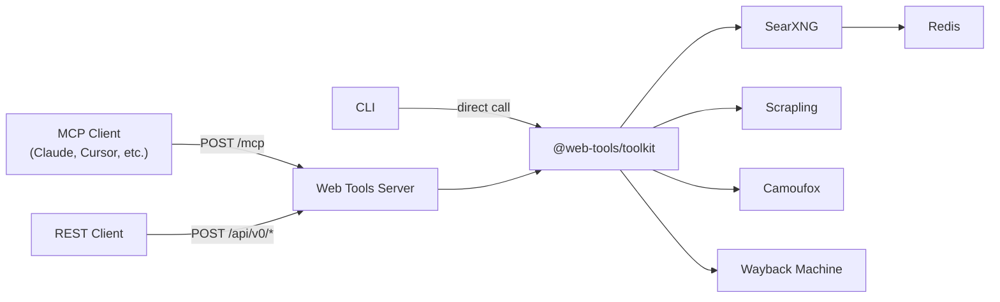

# Web Tools

**Web tools for AI agents to search, read, and act on the web, on your own infrastructure.**

Fifteen tools your agent calls over [MCP](https://modelcontextprotocol.io/), REST, or a CLI:

- **Search**: `web_search` (SearXNG metasearch: Google, Brave, DuckDuckGo and more)
- **Read**: `web_fetch` returns clean markdown, plus `web_html`, `web_crawl`, `web_screenshot`, `web_pdf`, `web_bytes`, and the Wayback Machine (`web_snapshots`, `web_archive`)
- **Act**: `web_form_submit` fills and submits a form with a guarded single POST; `web_execute_js`, `web_eval` and `web_spa_fetch` drive pages in a real browser
- **Operate**: `web_recycle` (fresh browser and exit IP), `web_usage_stats` (call counts and proxy cost)

It is an open-source, self-hosted alternative to Firecrawl, Linkup, Tavily, Exa,
Bright Data and Browser Use (see [Comparison](#comparison)). The stack is five
services you own, deployable to Railway in one click. There is no per-call fee
and no LLM tokens are spent on web access. Under the hood it runs
[SearXNG](https://github.com/searxng/searxng),
[Scrapling](https://github.com/D4Vinci/Scrapling) (Chromium) and
[Camoufox](https://github.com/daijro/camoufox) (stealth Firefox on a residential
exit). The server picks the fetcher for each host, so callers never have to.

## Architecture


```mermaid
graph LR
    MCP["MCP Client<br/>(Claude, Cursor, etc.)"] -->|POST /mcp| Server["Web Tools Server"]
    API["REST Client"] -->|POST /api/v0/*| Server
    CLI["CLI"] -->|direct call| Toolkit["@web-tools/toolkit"]
    Server --> Toolkit
    Toolkit --> SearXNG
    SearXNG --> Redis
    Toolkit --> Scrapling
    Toolkit --> Camoufox
    Toolkit --> Wayback["Wayback Machine"]
```

### Why two fetchers

They are not redundant. Each reaches pages the other cannot, and the split is
measured rather than aesthetic:

| | Scrapling | Camoufox |
| --- | --- | --- |
| Browser | Patchright Chromium | **Firefox** |
| Egress | direct (`fast`) / rotating **US** residential (`stealth`) / solving (`solve`) | rotating **Italian** residential |
| JS challenges | yes (`solve`, evidence-gated) | n/a (coherent fingerprint) |
| Markdown + captures | **yes** (`/markdown`, `/screenshot`, `/pdf`, `/eval`) | no |
| LinkedIn profiles | 94% (34/36) | not measured |
| Italian bot-gated sites | wrong country | **the point** |
| Trustpilot reviews | interstitial only (escalation deliberately refused) | **full page** with a forced wait |
| Binary / PDF fetch | no | yes (`web_bytes`) |
| Anti-bot sensor sessions | no | yes (`web_spa_fetch`) |
| Ordinary pages | ~0.7-1.9s (`fast`), markdown in 14-200ms | ~8-12s |

Camoufox is Firefox on purpose: stealth-patched headless *Chrome* was flagged by
Akamai even through an Italian residential IP, while Camoufox's fingerprint is
internally coherent: its locale and timezone are derived from the exit IP, so
`web_eval` on an Italian site reports `Europe/Rome`. Italian sources either
bot-gate datacenter IPs outright or score the exit country as part of a sensor
decision, and a US residential exit is not a milder version of the right answer.

A third fetcher (Crawl4AI) was removed on 2026-09-27 after a benchmark; see
`AGENTS.md`.

### Fetch strategy

Callers never choose an engine. `web_fetch` and `web_html` take a URL; how to
reach it is decided internally, in three tiers:

| Tier | Egress | Chosen when |
| --- | --- | --- |
| `fast` | direct, no challenge solving | the default |
| `stealth` | rotating residential proxy | host is known to wall datacenter IPs (LinkedIn's HTTP 999) |
| `solve` | direct, solves the JS challenge | the `fast` response looks like a challenge page |

`fast` is the default rather than `solve` even though `solve` is functionally a
superset: solving roughly doubles latency on ordinary pages, and on a challenge
it *cannot* solve it blocks for the whole timeout instead of failing fast. So
solving is paid for only on evidence. A small body carrying a known
interstitial title with a 403/429/503 gets retried once in `solve`, and the
response reports `escalated: true`.

So: **Scrapling owns fetch, markdown and captures; Camoufox owns the Italian
exit.** Every URL tool — `web_fetch`, `web_html`, `web_crawl`, `web_screenshot`,
`web_pdf`, `web_execute_js` — routes by host (Italian and bot-walled hosts to
Camoufox, the rest to Scrapling). When one backend fails, the other is the
fallback in both directions; if both fail, the error names both causes. HTML is
rendered to markdown by Scrapling's CPU-only `/markdown`, or locally in the
Tools process (turndown) when Scrapling is down, so `web_fetch`, `web_crawl`
and `web_archive` survive a Scrapling outage. PDFs are Chromium-only: for a
Camoufox host, Camoufox renders the page and Scrapling prints that DOM.

The project is structured as a **monorepo** with three packages:

- **`packages/toolkit`**: Core business logic: Zod schemas, tool definitions, SearXNG/Scrapling/Camoufox/Wayback clients. Framework-agnostic.
- **`packages/api`**: Express HTTP server exposing MCP (`POST /mcp`) and REST (`POST /api/v0/{tool_name}`) endpoints.
- **`packages/cli`**: Commander.js CLI for terminal usage.

The full stack deploys as **5 services**: Redis, SearXNG, Scrapling, Camoufox, and the Web Tools server.

Browser form execution uses Camoufox's [single-attempt form contract](services/camoufox/FORMS.md).

## Tools

The server exposes sixteen tools. One more, `web_agent`, is [coming](#coming-soon).

### `web_search`

Lightweight web search via SearXNG with parallel request strategy for reliability.

| Parameter | Type              | Description                                  |
| --------- | ----------------- | -------------------------------------------- |
| `query`   | string (required) | The search query                             |
| `limit`   | number (optional) | Max results to return (default: 10, max: 20) |
| `engines` | string (optional) | Comma-separated engines (e.g. "google,brave") |

Returns a JSON array of `{ url, title, description }` results.

### `web_fetch`

Fetch a single URL and return its content as clean markdown. Fetched and
rendered by Scrapling (`/fetch` + `/markdown`); Italian and bot-walled hosts
route through Camoufox.

| Parameter | Type              | Description                                                              |
| --------- | ----------------- | ------------------------------------------------------------------------ |
| `url`     | string (required) | URL to fetch                                                             |
| `f`       | enum (optional)   | Content filter: `fit` (body only, default) or `raw` (whole document)     |
| `delay`   | number (optional) | Seconds to settle after the page is stable (default: 0)                  |

Returns the page content as markdown.

**There is no engine or mode parameter.** Which fetcher runs, whether it goes
out through the residential proxy, and whether it solves a JS challenge are all
decided under the hood. See [Fetch strategy](#fetch-strategy).

### `web_html`

Fetch a URL and return the raw HTML as served, plus the upstream status. Use
this rather than `web_fetch` when you need markup that markdown conversion
destroys: JSON-LD, meta tags, attributes.

| Parameter      | Type              | Description                                             |
| -------------- | ----------------- | ------------------------------------------------------- |
| `url`          | string (required) | URL to fetch                                            |
| `network_idle` | boolean (optional)| Wait for the network to go quiet (default: false)        |
| `wait_until`   | enum (optional)   | `load` (default), `domcontentloaded`, `networkidle`, `commit` |
| `wait_ms`      | number (optional) | Extra settle time after load, in ms (max 60000)         |
| `click_all`    | string[] (optional)| CSS selectors clicked (every match) before capture, for lazy accordions and tabs |
| `settle_ms`    | number (optional) | Time for AJAX to settle after `click_all` (default: 3000, max 30000) |
| `fresh_ip`     | boolean (optional)| Serve from a new browser context on a new exit IP with clean cookies (~1s) |
| `timeout_ms`   | number (optional) | Upstream fetch timeout (default: 60000, max: 90000)     |

These describe how to treat the *page*, not which backend runs it. Each is
honoured where the serving backend supports it and ignored where it does not.

Returns a JSON object: `{ status, url, mode, escalated, size, html }`. A
non-2xx upstream status is reported in `status` rather than raised as an error,
so callers can branch on 999 vs 404 themselves.

### `web_screenshot`

Capture a full-page PNG screenshot of a URL. Scrapling's `/screenshot`; Italian
and bot-walled hosts go through Camoufox.

| Parameter             | Type              | Description                                 |
| --------------------- | ----------------- | ------------------------------------------- |
| `url`                 | string (required) | URL to screenshot                           |
| `screenshot_wait_for` | number (optional) | Seconds to wait before capture (default: 2) |

MCP returns it as `image` content (`mimeType: image/png`); REST keeps the v0
shape, `{ content: [{ type: "text", text: <base64 PNG> }], isError }`.

### `web_pdf`

Convert a URL to PDF (Chromium print-to-PDF). For Italian and bot-walled hosts
Camoufox renders the page and Scrapling prints the rendered DOM.

| Parameter | Type              | Description           |
| --------- | ----------------- | --------------------- |
| `url`     | string (required) | URL to convert to PDF |

MCP returns an embedded `resource` (`mimeType: application/pdf`, base64 `blob`);
REST keeps the v0 shape, base64 PDF as text content.

### `web_execute_js`

Execute JavaScript snippets on a URL in order and return their results as JSON.

| Parameter | Type                | Description                                     |
| --------- | ------------------- | ----------------------------------------------- |
| `url`     | string (required)   | URL to execute scripts on                       |
| `scripts` | string[] (required) | List of JavaScript snippets to execute in order |

Returns `{ status, url, mode, results }` — one entry per script, in order.

### `web_crawl`

Crawl one or more URLs sequentially through the same pipeline as `web_fetch`
(fetch + markdown render per URL) and return one payload.

| Parameter     | Type                | Description                                            |
| ------------- | ------------------- | ------------------------------------------------------ |
| `urls`        | string[] (required) | URLs to crawl, in order (max 20)                       |
| `css_selector`| string (optional)   | Convert only elements matching this selector           |
| `timeout_ms`  | number (optional)   | Per-URL fetch timeout (default: 60000, max: 90000)     |

Returns `{ results: [{ url, status_code, success, mode, renderer, markdown }] }`
(`renderer` is `scrapling` or `local`). A failed URL reports
`{ url, status_code: 0, success: false, error }` in its own slot without
sinking the batch. The whole crawl has a 300 s budget; URLs it does not reach
come back the same way.

### `web_snapshots`

List Wayback Machine snapshots for a URL.

| Parameter    | Type                | Description                                                             |
| ------------ | ------------------- | ----------------------------------------------------------------------- |
| `url`        | string (required)   | URL to check for snapshots                                              |
| `from`       | string (optional)   | Start date in YYYYMMDD format                                           |
| `to`         | string (optional)   | End date in YYYYMMDD format                                             |
| `limit`      | number (optional)   | Max number of snapshots to return (default: 100)                        |
| `match_type` | enum (optional)     | URL matching: `exact`, `prefix`, `host`, or `domain` (default: `exact`) |
| `filter`     | string[] (optional) | CDX API filters (e.g. `["statuscode:200", "mimetype:text/html"]`)       |

Returns a JSON array of snapshots with timestamps, status codes, and archive URLs.

### `web_archive`

Retrieve an archived page from the Wayback Machine.

| Parameter   | Type               | Description                                                          |
| ----------- | ------------------ | -------------------------------------------------------------------- |
| `url`       | string (required)  | URL of the page to retrieve                                          |
| `timestamp` | string (required)  | Timestamp in YYYYMMDDHHMMSS format                                   |
| `original`  | boolean (optional) | Get original content without Wayback Machine banner (default: false) |

Returns the archived page content.

### `web_bytes`

Download a URL's raw bytes through the residential exit, base64-encoded. Use for
PDFs and other binaries behind a bot-gated or geo-sensitive origin, where
rendering the page as text would lose the document.

| Parameter    | Type              | Description                          |
| ------------ | ----------------- | ------------------------------------ |
| `url`        | string (required) | URL of the binary to download        |
| `timeout_ms` | number (optional) | Fetch timeout (default: 60000)       |

Returns `{ status, url, size_b64, b64 }`. A non-2xx arrives in `status` rather
than raised, so a caller fetching a PDF that 404s still learns what happened.

### `web_form_inspect`

Read a form without submitting it: call this **first**, then `web_form_submit`
once. Same browser path as the submit, but it never fills, clicks or dismisses
anything, and it blocks every mutating request (any origin).

| Parameter                  | Type               | Description |
| -------------------------- | ------------------ | ----------- |
| `url`                      | string (required)  | Page holding the form |
| `wait_until`, `wait_ms`    | (optional)         | Navigation condition and settle after load (default 4000 ms) |
| `timeout_ms`               | number (optional)  | Whole-run deadline (default: 60000) |
| `fresh_ip`, `exit_session` | (optional)         | Exit IP; reuse the `exit_session` token to submit from the same IP |
| `profile`, `headed`        | (optional)         | As `web_form_submit` |

It returns `{ ok, url, status, forms, captcha, cookie_banners, wizard, diagnostics }`.
Each form has `action`, `method`, `fields`, `submit_candidates`,
`honeypot_candidates` and `suggested`. Each field is
`{ selector, name, type, action, label, required, placeholder?, autocomplete?, options? }`.
A radio group is one field: to choose an option, check its `options[].selector`.
`suggested` is a ready `web_form_submit` request (required fields, best submit
control, `dismiss`, `captcha_field`). Add the values and leave out the
honeypots. `captcha` names the provider (reCAPTCHA v2/v3/enterprise, hCaptcha,
Turnstile) and says whether a sitekey is present; the key itself is never
returned. No field values are ever returned, and any failure is safe to retry.

### `web_form_submit`

Fill a form and click submit **once** in a real browser (Camoufox, on the
residential exit), then report what actually happened. You supply the
selectors and values; the service owns navigation, typing (keystroke by
keystroke), cookie isolation, cleanup, and a context-wide guard that blocks
duplicate POSTs. It never solves or mints a CAPTCHA: the page's own handler runs
and its own integration mints the token. The full contract is in
[`services/camoufox/FORMS.md`](services/camoufox/FORMS.md).

| Parameter               | Type                | Description |
| ----------------------- | ------------------- | ----------- |
| `url`                   | string (required)   | Page holding the form |
| `fields`                | object[] (required) | `{ selector, value?, action? }` in order; `action` is `type` (default), `check`, or `select` |
| `submit`                | string (required)   | CSS selector of the submit control |
| `dismiss`               | string[] (optional) | Selectors clicked first (cookie walls) |
| `success_url`           | string (optional)   | Regex; a final URL matching it means success |
| `submission_urls`       | string[] (optional) | Same-origin POST endpoints sharing one submission budget (default: `url`) |
| `captcha_field`         | string (optional)   | POST field checked for token *presence*, never its value (default `g-recaptcha-response`) |
| `require_captcha_token` | boolean (optional)  | Block the POST when that field is empty or unreadable; no retry |
| `ready_expression`      | string (optional)   | Main-world boolean expression that must hold before the click |
| `inspect_only`          | boolean (optional)  | Navigate only: no fill, no click, same-origin mutating requests blocked |
| `wait_until`, `wait_ms` | (optional)          | Navigation condition and settle after load (default 4000 ms) |
| `settle_ms`             | number (optional)   | How long to wait for the outcome (default: 20000) |
| `timeout_ms`            | number (optional)   | Whole-run deadline incl. the score gate and retries (default: 120000; a wizard needs ~240000; max 360000, or 540000 with `retry_on_captcha_rejection`) |
| `fresh_ip`              | boolean (optional)  | New context and exit IP (default: true) |
| `exit_session`          | string (optional)   | Pin the exit: the same token lands on the same IP, so an exit that passed can be reused |
| `headed`                | boolean (optional)  | Headed browser under Xvfb for score-gated forms (reCAPTCHA v3 scores headless fleets at 0) |
| `profile`               | string (optional)   | Named persistent profile: cookies and fingerprint reused across submissions (per replica) |
| `gate_text`             | string (optional)   | Wizard: regex on a gate button's text, clicked **once** after step 0 |
| `step2`, `step2_submit` | (optional)          | Wizard: second-step fields and submit (default `form button`), used only if that step renders |
| `completion_markers`    | string[] (optional) | Wizard: body-text regexes that count as completion when the URL never changes |
| `stop_after_posts`      | number (optional)   | Wizard warm-up: stop once this many POSTs (1-3) have been answered |
| `score_gate`            | boolean (optional)  | Probe exits on our reCAPTCHA oracle first and submit from the first scoring ≥ `score_threshold` (default: on when `headed` and no `exit_session`) |
| `score_threshold`       | number (optional)   | Score gate threshold, 0-1 (default: 0.7) |
| `score_gate_tries`      | number (optional)   | Exits the gate probes at most, 1-6 (default: 3) |
| `retry_on_captcha_rejection` | number (optional) | 0-4 (default 0). Fresh attempts (new context, new exit, re-gated) **only** after an explicit step-0 CAPTCHA refusal: one 2xx POST, same URL, every error node matching `captcha_rejection_text`. Never with a pinned `exit_session`/`profile`; each retry must fit `timeout_ms` |
| `captcha_rejection_text` | string (optional)  | Case-insensitive regex the form's error nodes must all match (default `error verifying recaptcha\|captcha (?:non \|in)?valid\|recaptcha`) |

Returns `{ contract_version: 2, ok, form_submissions, status, error, url, html, exit_session, diagnostics }`.
With `retry_on_captcha_rejection`, the result is the final attempt's plus
`attempts: [{ n, error, ok, status, form_submissions, score_gate_score, asn }]`,
and `form_submissions` is the total across attempts (each refused attempt was a
real POST).
`status` is the matching POST's response, not the initial GET. `ok` needs at
least one POST, a 2xx/3xx answer, and a `success_url` match (on a wizard, a
completion marker instead). `diagnostics` reports passive CAPTCHA and network
counts and whether a token was present. It never includes field values, tokens
or request bodies.

**Retry rule.** This tool is single-attempt and not idempotent. Persist your
own reservation *before* calling it, and treat a lost response, a timeout, or a
502 as an **unknown outcome**: something may have been submitted. The only
sanctioned replay is the sidecar's **503 with `retryable: true`**. It is sent
only when the service can prove that nothing was posted: the run stalled before
the click, or failed at launch, navigation or field filling with zero POSTs.
Through the Tools API every failure is structured JSON with `isError: true`:

- `{ ok: false, retryable: true, outcome: "not_submitted", form_submissions: 0 }`: replay is allowed.
- `{ retryable: false, outcome: "unknown" }`: never replay.
- `{ retryable: false, outcome: "invalid_request" }`: your own validation error.

Answered runs carry `retryable: false`. Replay at most a couple of times,
seconds apart. Do not wrap this tool in a generic HTTP retry policy.

### `web_eval`

Evaluate JavaScript in a residential browser page and return its JSON result. Use
for driving or inspecting a JS app (open a facet, read the codes behind it) on a
site that bot-gates this host's own IP, which `web_execute_js` cannot reach
because it runs from that IP.

| Parameter      | Type              | Description                                                  |
| -------------- | ----------------- | ------------------------------------------------------------ |
| `url`          | string (required) | URL to open                                                  |
| `js`           | string (required) | Expression or IIFE evaluated in the page; must return JSON    |
| `wait_until`   | enum (optional)   | `load`, `domcontentloaded`, `networkidle`, `commit`           |
| `wait_ms`      | number (optional) | Extra settle time after load (default: 6000)                  |
| `timeout_ms`   | number (optional) | Navigation timeout (default: 90000)                           |
| `fresh_ip`     | boolean (optional)| Serve from a new context on a new exit IP, with clean cookies  |

Returns `{ status, url, result }`.

### `web_spa_fetch`

Perform a same-origin in-page fetch on a warmed browser session, for origins that
gate requests on an anti-bot sensor cookie.

| Parameter          | Type              | Description                                                     |
| ------------------ | ----------------- | --------------------------------------------------------------- |
| `base_url`         | string (required) | Origin to warm and fetch against                                 |
| `path`             | string (required) | Same-origin path for the in-page fetch                           |
| `warm_path`        | string (optional) | Path navigated to warm the sensor (default: `/`)                 |
| `method`           | string (optional) | HTTP method (default: `GET`)                                     |
| `body`             | object (optional) | JSON body, sent as a JSON string                                 |
| `accept`           | string (optional) | Accept header (default: `application/json`)                      |
| `sensor_wait_ms`   | number (optional) | Time spent seeding the sensor on a warm (default: 20000)         |
| `mature_probe`     | object (optional) | `{method,path,body,accept}` replayed until it stops returning 403 |
| `mature_max_tries` | number (optional) | Maturation attempts (default: 6)                                 |
| `timeout_ms`       | number (optional) | Client timeout (default: 180000)                                 |

Returns `{ status, text }`, where `status` is the in-page fetch's own HTTP status.
A 403 means the sensor has not cleared, so the caller should re-mature or recycle.

This is the only stateful tool here. The sidecar keeps one warmed page per
`(base_url, warm_path)`, pins it to a sticky residential exit and feeds the sensor
on a keepalive so the cookie stays validated. Treat the session as shared:
`web_recycle`, or anything that tears the browser down, costs whoever is mid-crawl
their maturation.

### `web_recycle`

Drop the warmed session and the render browser, and take a fresh exit IP. No
parameters.

Expensive (a full browser relaunch) and disruptive to any crawl in flight, so
reach for it only when an exit IP has been rate-hardened by a target and will not
recover on its own. For a fresh IP on a single request, pass `fresh_ip` to
`web_eval` instead, which costs about a second.

### `web_usage_stats`

Process-local usage counters: per-tool call counts, approximate proxy bandwidth
and an estimated cost. No parameters.

In-memory only, so it resets on container restart; the `started_at` field lets a
caller detect that. The proxied tools' byte counts are an upper bound rather
than a measurement: this process cannot see which sidecar mode actually served a
call, and over-counting a cost estimate is the safe direction.

### Coming soon

Not shipped yet; the names and shapes below may change.

- **`web_agent`**: give it a task in plain language and it browses until done,
  then returns a structured result within a step cap. It will be built on
  [browser-use](https://github.com/browser-use/browser-use) in Chromium.
  Form submission will be delegated to `web_form_submit`, so its single-POST
  guard still applies. It needs an LLM key and will report itself as disabled
  when none is set.

## Comparison

How web-tools compares with the hosted products it replaces, from each vendor's
public docs and pricing pages as of 2026-10-02. "—" means the vendor does not
document the feature.

| | Firecrawl | Tavily | Exa | Linkup | Bright Data | Browser Use Cloud | **web-tools** |
| --- | --- | --- | --- | --- | --- | --- | --- |
| Web search | `/search` | `/search` | own neural index | `/search` | SERP API | — | SearXNG metasearch (no own index, no semantic search) |
| Fetch → markdown | `/scrape` | `/extract` | `/contents` (text) | `/fetch` | Web Unlocker, MCP `scrape_as_markdown` | — | `web_fetch` |
| Crawl | `/crawl` | `/crawl` | subpages (≤100) | — | Crawl API | — | `web_crawl` (your URL list; no link discovery yet) |
| Site map | `/map` | `/map` | — | — | Crawl API | — | **not yet** |
| Structured (schema) extract | JSON format | — | JSON-schema summaries | structured output | per-site Scraper APIs | — | **not yet** |
| Screenshot / page → PDF | screenshot / — | — | — | — | via Browser API | — | both |
| Anti-bot fetch | yes (cloud only) | — | — | — | Web Unlocker, CAPTCHA solving | stealth, proxies, CAPTCHA solving | residential exits you supply, stealth Firefox, JS-challenge solve; **no CAPTCHA solver** |
| Form submission | actions (click/write) | — | — | — | Browser API | via agent | `web_form_submit` (guarded single POST) |
| Agent browser | Agent | — | — | — | — | yes (core product) | **coming** (`web_agent`) |
| Deep research | — | `/research` | Deep search, Agent | `/research` | — | — | **not yet** |
| Self-hosted | AGPL-3.0, without Fire-engine anti-bot, screenshots, actions or agent | no | no | no | no (MCP server is MIT, calls their API) | library is MIT; stealth is cloud-only | **yes, MIT, all features** |
| Price | 1,000 free credits/mo; from $16/mo for 5,000 | 1,000 free credits/mo; $0.008/credit | $7/1k searches, $1/1k pages | $0.005-0.006/search, $0.001-0.006/fetch | Web Unlocker $1.5/1k; 5,000 free MCP req/mo | $0.02/browser-hour + proxy $5/GB + model cost +20% | Railway hosting + your proxy bandwidth; no per-call fee |

What the hosted products still do better: their own search indexes (Exa's
semantic search especially), schema-driven extraction, site maps, research
endpoints, and managed CAPTCHA solving. web-tools covers search, read, capture
and forms on infrastructure you control.

## Interfaces

### MCP

All MCP-compatible clients can connect via HTTP:

#### Claude Code (CLI)

```bash
claude mcp add web_tools \
  --transport http \
  https://your-server.up.railway.app/mcp \
  --header "Authorization: Bearer your-api-key"
```

#### Project-level config (`.mcp.json`)

```json
{
  "mcpServers": {
    "web_tools": {
      "type": "http",
      "url": "https://your-server.up.railway.app/mcp",
      "headers": {
        "Authorization": "Bearer your-api-key"
      }
    }
  }
}
```

#### Claude Desktop (`claude_desktop_config.json`)

```json
{
  "mcpServers": {
    "web_tools": {
      "type": "http",
      "url": "https://your-server.up.railway.app/mcp",
      "headers": {
        "Authorization": "Bearer your-api-key"
      }
    }
  }
}
```

### REST API

Every tool is also available as a REST endpoint. Bodies are validated with the
same schemas as MCP: invalid input is HTTP 400 `{ error: "invalid_params",
issues }`. `web_search`, `web_snapshots`, `web_archive` and `web_usage_stats`
answer with their JSON payload (HTTP 500 `{ error }` on failure); the other
tools answer with `{ content, isError }`.

```bash
# Discovery: list all tools
curl https://your-server.up.railway.app/api/v0 \
  -H "Authorization: Bearer your-api-key"

# Search
curl -X POST https://your-server.up.railway.app/api/v0/web_search \
  -H "Authorization: Bearer your-api-key" \
  -H "Content-Type: application/json" \
  -d '{"query": "railway deployment"}'

# Fetch
curl -X POST https://your-server.up.railway.app/api/v0/web_fetch \
  -H "Authorization: Bearer your-api-key" \
  -H "Content-Type: application/json" \
  -d '{"url": "https://example.com"}'
```

### CLI

```bash
# Search
web-tools search "railway deployment" --limit 5

# Fetch page as markdown
web-tools fetch https://example.com

# Screenshot
web-tools screenshot https://example.com

# Crawl multiple URLs
web-tools crawl https://a.com https://b.com --selector "main"

# Wayback Machine
web-tools snapshots https://example.com --from 20200101
web-tools archive https://example.com --timestamp 20200101120000
```

### Replace Claude Code's Built-in Web Search & Web Fetch (Optional)

**1. Add the MCP server globally:**

```bash
claude mcp add web_tools --scope user \
  --transport http \
  https://your-server.up.railway.app/mcp \
  --header "Authorization: Bearer your-api-key"
```

**2. Disable the built-in tools** by editing `~/.claude/settings.json`:

```json
{
  "permissions": {
    "deny": ["WebSearch", "WebFetch"]
  }
}
```

**3. Guide Claude via `~/.claude/CLAUDE.md`** so it uses your tools:

```markdown
## Search & Fetch

- Use the web_search MCP tool for all web searches
- Use the web_fetch MCP tool to fetch and read web pages
- Do not attempt to use the built-in WebSearch or WebFetch tools
```

## Deployment (Railway)

[](https://railway.com/deploy/web-tools?referralCode=zMTz_F&utm_medium=integration&utm_source=template&utm_campaign=generic)

- Click **Deploy on Railway**: you'll see the services listed (Redis, SearXNG, Scrapling, Camoufox, Web Tools Server)
- Click **Deploy**: Railway provisions everything and wires the services together automatically
- An `API_KEY` is **auto-generated** during deployment. Find it in your Web Tools service's **Variables** tab and use it as your Bearer token

### Railway Configuration

The **Web Tools Server** service uses the root `Dockerfile`, so no config changes are needed.

The **SearXNG** and **Scrapling** services build from the repo instead of a Docker
image, and each one **must** have its Root Directory set:

| Service | Root Directory | Env |
| --- | --- | --- |
| SearXNG | `services/searxng` | `PROXY_URL` (optional), the proxy for outgoing search requests |
| Scrapling | `services/scrapling` | `PROXY_URL` (US-geo, for the residential path), `PORT=8000` |
| Camoufox | `services/camoufox` | `PROXY_URL` (**IT-geo**), `PORT=8000`, `WORKERS=1` |

> Camoufox keeps `WORKERS=1`, because one warmed anti-bot session per container
> cannot be shared across processes. Scale it with **replicas**, not workers:
> `railway service scale --service camoufox eu-west=2`. Keep it in EU West; a US
> container reaches an Italian exit and an Italian target across the Atlantic
> twice. Note `scale` ADDS to existing regions, so pass `us-east=0` to move
> rather than spread.

> **Set Root Directory before connecting the repo.** Railway resolves a service's
> build config by walking up from its Root Directory, so a subfolder service
> without one inherits the repo root's `Dockerfile`, which is the Node server.
> The symptom is confusing: the build goes green, then the container crashes on
> `ZodError: API_KEY Required`, because it is running the API server instead of
> the sidecar. It also repeats on every push, so a service deployed correctly by
> hand will replace itself with the API server the next time the repo changes.
>
> `railway up` cannot fix this: it uploads the right files but leaves the stored
> config pointing at `/`. Root Directory is not exposed by the CLI either; set it
> in the dashboard, or via the public API:
>
> ```bash
> curl https://backboard.railway.com/graphql/v2 \
>   -H "Authorization: Bearer $RAILWAY_TOKEN" -H "Content-Type: application/json" \
>   -d '{"query":"mutation($s:String!,$e:String,$i:ServiceInstanceUpdateInput!){serviceInstanceUpdate(serviceId:$s,environmentId:$e,input:$i)}",
>        "variables":{"s":"<serviceId>","e":"<environmentId>",
>        "i":{"rootDirectory":"/services/scrapling",
>             "dockerfilePath":"/services/scrapling/Dockerfile",
>             "watchPatterns":["/services/scrapling/**"]}}}'
> ```
>
> Do not pass `builder`, because the `Builder` enum has no `DOCKERFILE` value (only
> HEROKU/NIXPACKS/PAKETO/RAILPACK) and the whole mutation fails with a generic
> "Problem processing request". Railway detects the Dockerfile from the path.
>
> The anchored `watchPatterns` is worth setting too: without it every push to the
> repo rebuilds the sidecar, including pushes that do not touch it.

Point the server at its siblings with **reference variables** rather than
hardcoded hostnames, so renaming or moving a service does not silently break
private networking:

```
SCRAPLING_URL = http://${{Scrapling.RAILWAY_PRIVATE_DOMAIN}}:${{Scrapling.PORT}}
CAMOUFOX_URL  = http://${{Camoufox.RAILWAY_PRIVATE_DOMAIN}}:${{Camoufox.PORT}}
SEARXNG_URL   = http://${{SearXNG.RAILWAY_PRIVATE_DOMAIN}}:8080
```

Reference `${{Service.PORT}}` only where the service actually **binds** it and has
no default of its own to diverge from. That holds for the two images in this repo:
their CMD is `uvicorn --port ${PORT}` and they deliberately ship no `ENV PORT`, so
the Railway variable is the single source of truth for both the bind and the URL,
and a missing one stops the container at boot rather than yielding `http://host:`.

It does not hold for the third-party SearXNG image, whose URL keeps a literal
port: SearXNG hardcodes `--port 8080` in its entrypoint, so `PORT` is decoration
and a reference to it is a guess that fails open.

Service names are case-sensitive: `${{camoufox.…}}` against a service named
`Camoufox` resolves to an empty string rather than erroring, giving `http://:8000`.

## Quick Start (Local)

### 1. Clone and install

```bash
git clone https://github.com/arnaudjnn/web-tools
cd web-tools
pnpm install
```

### 2. Configure environment

```bash
cp .env.example .env.local
```

### 3. Run the sidecars you need, locally

Only the **Tools** service has a public domain. The four backing services are
private, reachable at `*.railway.internal` from inside the project and from
nowhere else, so a laptop cannot point at them. That is deliberate (see
[Exposure](#exposure)).

For most work you do not need them. Run the server against whichever sidecars you
build locally; each is self-contained, and every URL is optional:

```bash
docker build -t searxng services/searxng && docker run -d -p 8080:8080 \
  -e SEARXNG_SECRET_KEY=dev -e SEARXNG_REDIS_URL=redis://host.docker.internal:6379/0 searxng
docker run -d -p 6379:6379 redis:7-alpine

API_KEY=any-local-value \
SEARXNG_URL=http://localhost:8080 \
pnpm run start
```

The server is at `http://localhost:3000`. `API_KEY` is required but arbitrary
locally, since it only guards your own endpoint.

Leave a URL out and that path degrades rather than fails: `SEARXNG_URL` alone gives
you `web_search`; without `SCRAPLING_URL` the fetch/markdown/capture tools report
the missing sidecar instead of failing opaquely. The two stealth sidecars each
bake a browser into their image (~200MB Chromium for Scrapling, Camoufox's Firefox
plus a GeoIP database), and their residential paths need a `PROXY_URL` you supply,
so build them only when you are working on those paths specifically.

If you genuinely need to reach a deployed sidecar from your machine, add a service
domain temporarily (`railway domain --service Scrapling`) and delete it when you
are done. Do not leave one on: an exposed SearXNG is an open search proxy that
spends your metered residential bandwidth.

## Exposure

**Only `Tools` should have a public domain.** It is the authenticated front door
(`API_KEY` as a Bearer token); everything behind it talks over Railway's private
network:

| Service | Public domain | Why |
| --- | --- | --- |
| Tools | **yes** | the API surface: MCP + REST, API-key guarded |
| SearXNG | no | it has **no authentication of its own**, so a public domain is an open search proxy, and its outgoing requests egress through your metered `PROXY_URL` |
| Scrapling | no | residential egress + challenge solving; nothing should reach it but Tools |
| Camoufox | no | residential egress + warmed anti-bot sessions |

`SEARXNG_SECRET_KEY` is not an access credential. It is SearXNG's internal
signing secret, needed whether or not the service is exposed. Removing a public
domain is what makes a service private; deleting its credentials just makes it
broken or open.

## Environment Variables

| Variable | Required | Description |
| --- | --- | --- |
| `API_KEY` | Yes | Bearer token for authentication (auto-generated on Railway) |
| `SEARXNG_URL` | No | SearXNG URL (default: `http://searxng.railway.internal:8080`) |
| `SCRAPLING_URL` | No | Scrapling URL (default: `http://scrapling.railway.internal:8000`) |
| `CAMOUFOX_URL` | No | Camoufox URL (default: `http://camoufox.railway.internal:8000`) |
| `CAMOUFOX_FORMS_URL` | No | Forms-only Camoufox (`CAMOUFOX_ROLE=forms`) that takes every form call (default: `CAMOUFOX_URL`) |
| `SEARXNG_ENGINES` | No | Default engines (e.g. `"brave,bing"`) |
| `PROXY_URL` | No | Rotating residential proxy. Set on the **SearXNG**, **Scrapling** and **Camoufox** services, not the server. US-geo for Scrapling, **IT-geo** for Camoufox. |

## Authentication

The `API_KEY` environment variable is **required**.

On Railway, the key is auto-generated at deploy time (via `${{secret()}}`). For local development, set it in your `.env.local` file.

Clients provide the key as a `Bearer` token in the `Authorization` header or as an `?api_key=` query parameter. The `/health` endpoint is unauthenticated.

## License

MIT
